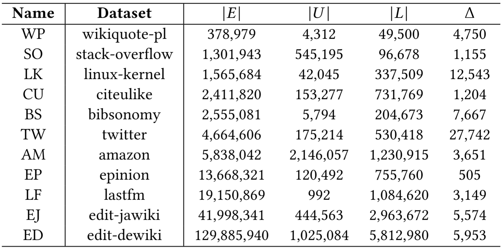
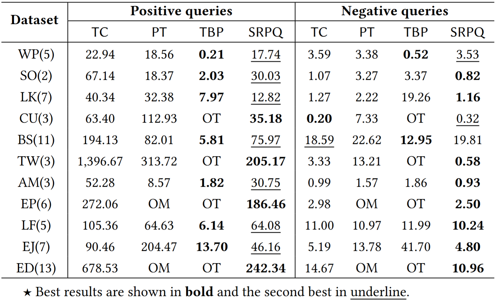
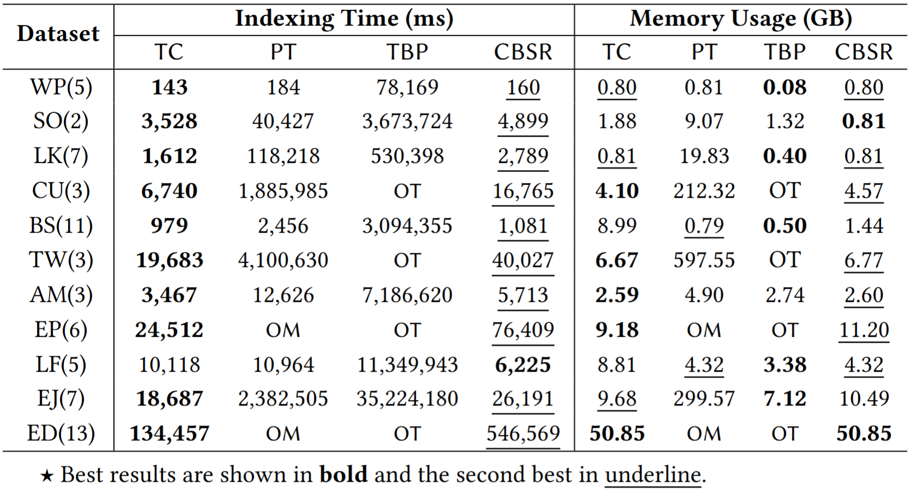
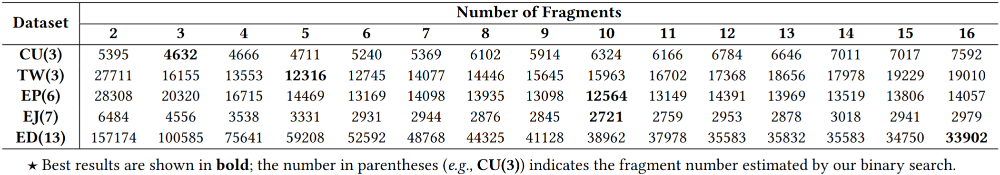

# CBSR

**This is the official implementation of _CBSR: A Contraction Framework for Answering Reachability Queries on Temporal Bipartite Graphs_.**

📄 The full paper is available at [GitHub (PDF)](https://github.com/dengt2000/SRPfull/blob/main/SRPfull.pdf).

## 🔍 Abstract
CBSR addresses the problem of answering span-reachability problem for temporal bipartite graphs. By transforming the graph into a DAG and applying contraction-based indexing, CBSR enables efficient and scalable indexing and query processing. Experimental results on real-world datasets show that CBSR outperforms existing methods such as TopChain and TBP.

## 🚀 Getting Started

### 🔧 Requirements

Make sure the following dependencies are installed:

- `cmake >= 3.20`
- `gflags`
- `boost`
- `jemalloc`

You may install them using your package manager. For example, on Ubuntu:

```bash
sudo apt update
sudo apt install cmake libgflags-dev libboost-all-dev libjemalloc-dev
```
### 🏗️ Build

Clone the repository and compile the project: 
```bash
git clone https://github.com/SunboTax/CBSR.git
cd CBSR
git submodule update --init --recursive
mkdir build && cd build
cmake ..
make -j8
```

### 📁 Dataset
You can download the datasets from [here](https://bhpan.buaa.edu.cn/link/AA792B469DD0D64D699590D25932C6E29F).

<p align="center">  </p>

The datasets should be placed in the directory `./dataset`.

If you want to use your own datasets, please ensure they are in the correct format like the example below:
```
# 3 5
0 0 1117404000 1117404673
0 2 1106002075 1106003187
0 1 1105916400 1105917105
0 3 1105570800 1105571496
1 5 1117404000 1117404673
1 2 1106002075 1106003187
1 1 1105916400 1105917105
```
3 and 5 are the number of nodes in the upper and lower partitions, respectively. 
Each line represents an edge with its start and end timestamps, formatted as:
```
<upper_node_id> <lower_node_id> <start_timestamp> <end_timestamp>
```
The edges of each upper node should sorted in descending order of `<start_timestamp>`.

### ▶️ Running CBSR
You can execute the program using the following command:
```bash
./Computation \
    --inputPath=[path_to_bipartite_graph_file] \
    --queryFilePath=[path_to_query_file] \
    --minBlock=[number_of_fragments] \
    --algorithm=[DAG_indexing_algorithm] \
    --outputPath=[path_to_output_file] \
    --delta=[latency_threshold]
```

### ⚙️ Parameters
- `--inputPath`: Path to the input temporal bipartite graph file.
- `--queryFilePath`: Path to the file containing reachability queries.
- `--minBlock`: Number of graph fragments used in contraction.
- `--algorithm`: Choose the indexing algorithm (e.g., CBSR, baseline).
- `--outputPath`: Output file path for results.
- `--delta`: Temporal latency threshold for reachability.

### 🧪 Experiments

#### 1. Algorithm Performance Evaluation
Run the full evaluation on all datasets, using the script below. The results will be saved in the `result` directory, and logs will be stored in the `log` directory.:
```bash
bash script/run.sh
```

#### 2. Scalability Test
To evaluate scalability, run the following script with the graph edit-enwiki([download here](https://bhpan.buaa.edu.cn/link/AA1FEBDB96E4DA451C91FC44213D5BBB9B)), including`[20% 40% 60% 80% 100%]`edges of the original graph size. Before running, ensure the dataset and query files are placed in the `dataset/bigraph` and `dataset/query` directories, respectively. 

```bash
bash script/run_scalability.sh
```

#### 3. Fragment Number Impact
To evaluate the impact of different fragment settings:
```bash
bash script/run_fragment.sh
```

#### 4. Latency Threshold Impact
To study how different values of delta (latency threshold) affect performance:
```bash
bash script/run_latency.sh
```

## 📊 Results
The results of the experiments are as follows. The abreviations used are:
- **TC**: [TopChain](https://ieeexplore.ieee.org/document/7498236)
- **PT**：[PathTree](https://dl.acm.org/doi/10.1145/1929934.1929941)
- **TBP**: [TBP](https://dl.acm.org/doi/10.14778/3467861.3467873)
- **CBSR**: Our proposed index construction method.
- **SRPQ**: Our proposed query processing method.

### 1. Algorithm Performance
#### a. Query Performance
The results are presented in microseconds (μs) for query processing time.
<p align="center">  </p>

#### b. Transformation Performance
$|E|$ is the number of edges in the bipartite graph, $|E_{DAG}|$ and $|V_{DAG}|$ are the number of edges and vertices in the DAG after transformation, respectively. 
<p align="center">  </p>

#### c. Index Construction Performance
`OM` representes that the out of memory(OOM) error occurs during the index construction, 
and `OT` representes that the index construction time exceeds over 24 hours.
<p align="center">  </p>

#### d. Cost Breakdown
The index construction process are divided into five phases:
- **Graph Transformation**: Converting the bipartite graph into a DAG, noted as **Trans**.
- **Partition**: Partitioning the DAG into fragments, noted as **Part**.
- **Equivalent Set Compuration**: Finding equivalence classes in each fragment, noted as **EqSet**.
- **Intra-Index Construction**: Building the index for each fragment, noted as **Inner**.
- **Inter-Index Construction**: Building the index for the contraction graph, noted as **Intra**.

<p align="center">  </p>

### 2. Scalability Test

The scalability test results show the performance of CBSR with varying graph sizes. The results are presented in the picture below, where the x-axis represents the percentage of edges used from the original graph size, and the y-axis shows the indexing time(s), the memory usage(GB) and the random generated query time(μs).
<p align="center">  </p>

### 3. Fragment Number Impact
The impact of the fragment number on the performance of CBSR is evaluated by varying the number of fragments from 1 to 64. The results are presented below, where IT, MU, PQT and NQT represent indexing time, memory us
age, positive query time, and negative query time, respectively.
<p align="center">  </p>


### 4. Latency Threshold Impact

The connection latency threshold introduces an additional constraint on temporal paths, reflecting real-world dynamics. For example, in epidemic spread, individuals recover after a certain period and no longer pose a risk of transmission. The latency threshold captures this time-bound effect. More broadly, it models temporal validity in various domains, such as virus transmission (recovery periods), information diffusion (decay over time), and investment behavior (time-limited influence of actions on others). The experimental results on the impact of this threshold are as follows:

<p align="center">  </p>

## 📄 License

This project is licensed under the [MIT License](./LICENSE.txt). You are free to use, modify, and distribute the code, provided that you include the original license and copyright notice.


## 📬 Contact

For any questions or issues, feel free to contact via:
- **e-mail**: sunlijun1@buaa.edu.cn or liaojunlong@buaa.edu.cn
- github issues: [CBSR Issues](https://github.com/SunboTax/CBSR/issues)

## 📣 Citation
If you find this work useful, please cite our paper:
```bibtex
@misc{CBSR2025,
  author       = {Sun Lijun and Liao Junlong and Deng Ting and Lu Ping and Zhang Richong and Li Jianxin and Huang Xiangping and Liu Zhongyi},
  title        = {CBSR: A Contraction Framework for Answering Reachability Queries on Temporal Bipartite Graphs},
  year         = {2025},
  note         = {Manuscript under review},
  howpublished = {\url{https://github.com/dengt2000/SRPfull/blob/main/SRPfull.pdf}}
}
```
